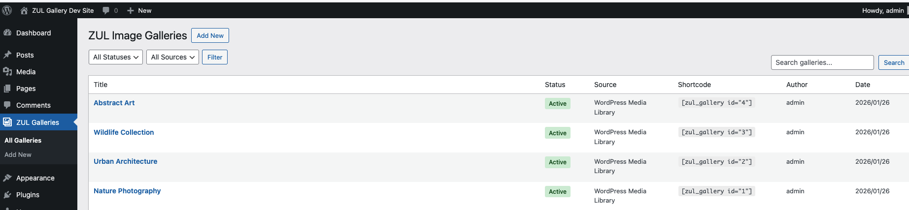
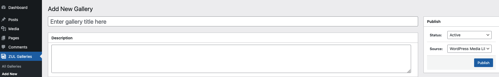
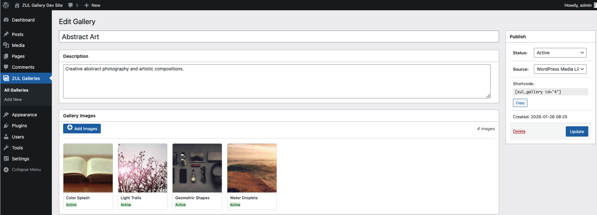
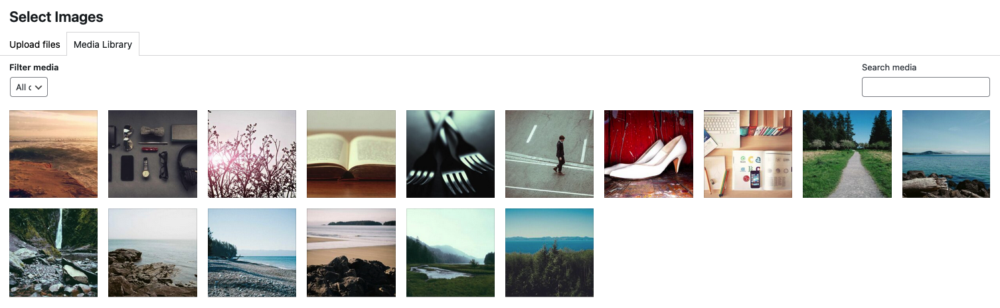
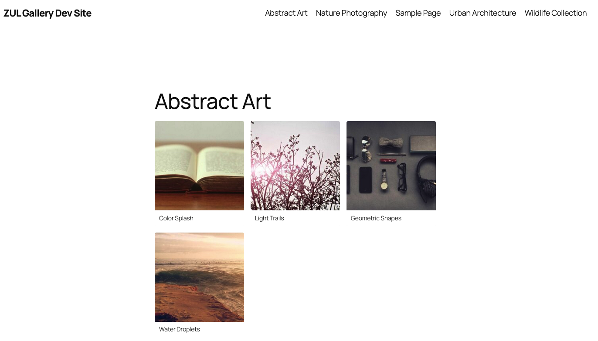
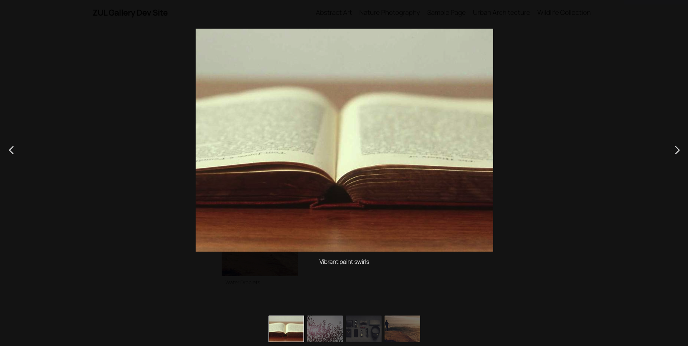

# ZUL Gallery Plugin

A WordPress plugin for managing image galleries with Fancybox lightbox support.

## Features

- Create and manage multiple image galleries
- Drag-and-drop image ordering
- WordPress Media Library integration
- Fancybox 5 lightbox with thumbnails, slideshow, and fullscreen
- Responsive grid layout (1-6 columns)
- Shortcode support for embedding galleries
- Role-based access control
- Extensible architecture (swappable image sources and renderers)

## Requirements

- WordPress 5.9+
- PHP 8.1+

## Installation

1. Upload the `zul-gallery-plugin` folder to `/wp-content/plugins/`
2. Activate the plugin through the WordPress admin
3. Navigate to **ZUL Galleries** in the admin menu

## Usage

### Admin Interface

1. Go to **ZUL Galleries** → **Add New**
2. Enter a title and description
3. Click **Add Images** to select from Media Library
4. Drag images to reorder
5. Set status to **Active** and save

### Shortcode

Embed a gallery in any post or page:

```
[zul_gallery id="123"]
```

**Parameters:**

| Parameter | Default | Description |
|-----------|---------|-------------|
| `id` | (required) | Gallery ID |
| `columns` | `3` | Number of columns (1-6) |
| `size` | `medium` | Image size (thumbnail, medium, large, full) |
| `link` | `file` | Link target (file, none) |
| `captions` | `true` | Show captions (true, false) |

**Example with options:**

```
[zul_gallery id="123" columns="4" size="large" captions="false"]
```

## Screenshots

### Gallery List


### Add New Gallery


### Edit Gallery


### Assign Images from Media Library


### Demao Frontend Gallery


### Fancybox Lightbox


## Development

### Cloning the Repository

This project uses git submodules. Clone with submodules included:

```bash
git clone --recurse-submodules <repository-url>
```

Or initialize submodules after cloning:

```bash
git clone <repository-url>
cd zul-gallery-plugin
git submodule update --init --recursive
```

### Docker Environment

Start the development environment with automatic setup:

```bash
./start.sh
```

This will:
1. Initialize git submodules (if not already done)
2. Check port availability using [zul-check-ports](https://github.com/thetycoon79/zul-check-ports)
3. Auto-select available ports if defaults are in use
4. Start Docker containers (WordPress + MySQL)
5. Install WordPress automatically via WP-CLI
6. Activate the ZUL Gallery plugin
7. Create 4 sample galleries with 4 images each
8. Display all URLs in a formatted summary

**Sample output:**
```
━━━━━━━━━━━━━━━━━━━━━━━━━━━━━━━━━━━━━━━━━━━━━━━━━━━━━━━━━━━━━━━━━━━━━━━━━━
                    ZUL Gallery Plugin - Ready!
━━━━━━━━━━━━━━━━━━━━━━━━━━━━━━━━━━━━━━━━━━━━━━━━━━━━━━━━━━━━━━━━━━━━━━━━━━

  WordPress Site:
  ➜  http://localhost:8080

  Admin Dashboard:
  ➜  http://localhost:8080/wp-admin
      Username: admin  |  Password: admin

  Gallery Admin:
  ➜  http://localhost:8080/wp-admin/admin.php?page=zul-galleries

  Sample Gallery Pages:
  ➜  [1] Nature Photography
      http://localhost:8080/?page_id=2
  ➜  [2] Urban Architecture
      http://localhost:8080/?page_id=3
  ➜  [3] Wildlife Collection
      http://localhost:8080/?page_id=4
  ➜  [4] Abstract Art
      http://localhost:8080/?page_id=5
```

### Port Management (zul-check-ports)

This project uses [zul-check-ports](https://github.com/thetycoon79/zul-check-ports) as a git submodule to handle dynamic port assignment.

**How it works:**

1. The port checker scans for available ports
2. If default ports (8080, 3307) are in use, it automatically finds alternatives
3. Assigned ports are saved to `.env.ports` which is sourced by the start script
4. Docker Compose uses the exported port variables

**Port configuration:**

| Service | Default | Range |
|---------|---------|-------|
| WordPress | 8080 | 8080-8199 |
| MySQL | 3307 | 3307-3399 |

The port ranges can be customized in `docker/scripts/check-ports.sh`.

**Updating the submodule:**

```bash
cd tools/zul-check-ports
git pull origin main
cd ../..
git add tools/zul-check-ports
git commit -m "Update zul-check-ports submodule"
```

**Environment variables:**

| Variable | Default | Description |
|----------|---------|-------------|
| `SKIP_SAMPLE_DATA` | `false` | Skip sample gallery creation |

```bash
# Skip sample data
SKIP_SAMPLE_DATA=true ./start.sh
```

### Available Commands

```bash
make start      # Start with port check
make up         # Start containers directly
make down       # Stop containers
make install    # Install composer dependencies
make test       # Run PHPUnit tests
make logs       # View WordPress logs
make shell      # Shell into WordPress container
make clean      # Remove volumes and generated files
```

### Running Tests

```bash
# Install dependencies and run tests
make install
make test

# Or with Docker directly
docker compose run --rm phpunit
```

### Project Structure

```
zul-gallery-plugin/
├── assets/
│   ├── css/
│   │   ├── admin-gallery.css
│   │   └── frontend-gallery.css
│   └── js/
│       ├── admin-gallery.js
│       └── frontend-gallery.js
├── docker/
│   └── scripts/
│       └── check-ports.sh      # Port checker wrapper
├── includes/
│   ├── Admin/
│   │   ├── Controllers/
│   │   ├── Views/
│   │   └── Menu.php
│   ├── Assets/
│   ├── Domain/
│   │   ├── Entities/
│   │   └── ValueObjects/
│   ├── Frontend/
│   │   └── Shortcodes/
│   ├── Interfaces/
│   ├── Renderers/
│   ├── Repositories/
│   ├── Services/
│   ├── Sources/
│   └── Support/
├── tools/
│   └── zul-check-ports/        # Git submodule for port management
├── tests/
│   ├── Mocks/
│   └── Unit/
├── docker-compose.yml
├── Makefile
├── phpunit.xml
├── start.sh
└── zul-gallery-plugin.php
```

## Architecture

The plugin follows a layered architecture:

- **Domain Layer** - Entities and Value Objects (Gallery, GalleryImage, Status)
- **Interface Layer** - Contracts for repositories, sources, and renderers
- **Infrastructure Layer** - Database repositories, image sources
- **Service Layer** - Business logic and orchestration
- **Presentation Layer** - Admin controllers, views, shortcodes

### Extensibility

**Custom Renderer:**

```php
add_filter('zul_gallery_renderer', function($renderer, $gallery) {
    return new MyCustomRenderer();
}, 10, 2);
```

**Custom Image Source:**

Implement `GalleryImageSourceInterface` for external image providers.

## Database Tables

The plugin creates two custom tables:

- `{prefix}zul_image_gallery` - Gallery metadata
- `{prefix}zul_image_gallery_images` - Gallery images

## Capabilities

- `zul_gallery_manage` - Full CRUD access (assigned to Administrator)
- `zul_gallery_view_admin` - View admin screens

## Hooks

### Actions

- `zul_gallery_before_render` - Before gallery HTML output
- `zul_gallery_after_render` - After gallery HTML output

### Filters

- `zul_gallery_renderer` - Override the gallery renderer
- `zul_gallery_shortcode_atts` - Modify shortcode attributes
- `zul_gallery_image_html` - Modify individual image HTML

## License

GPL v2 or later

## Credits

- [Fancybox](https://fancyapps.com/fancybox/) - Lightbox library

## Disclaimer

See [DISCLAIMER.md](DISCLAIMER.md) for full terms. This plugin is provided "as is" without warranty. Use at your own risk.
